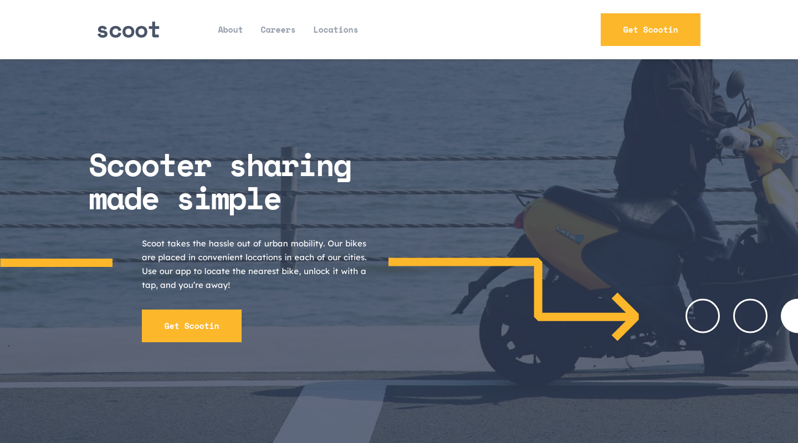

# Scoot Multi-Page Website

## Overview

### Project Description

Scoot is a fictional transportation company specializing in scooters. This project involves the creation of a multi-page website for Scoot, designed to be fully responsive and feature simple yet elegant animations to enhance user experience. The website includes pages such as Home, locations, About Us, and Contact. Placeholder external links, such as social media icons, are included but do not function as Scoot is a fictional company. The website aims to showcase Scoot's offerings and brand identity through engaging content and a user-friendly interface.

### Built With

- Semantic HTML5 markup
- CSS
- Mobile-first workflow
- [React](https://reactjs.org/) - JS library
- [tailwindCSS](https://tailwindcss.com/) - CSS library
- [framer-motion](https://www.framer.com/motion/) - Animation Library
- [react-router](https://reactrouter.com/en/main) - Routing library

### Screenshot

### Links

- Website Url - [https://scoot-multi-page-site.netlify.app/](https://scoot-multi-page-site.netlify.app/)
- Repository Url - [https://github.com/Ihezie/Scoot-Multi-Page-Website.git](https://github.com/Ihezie/Scoot-Multi-Page-Website.git)

### Author
- Frontend Mentor - [@Ihezie](https://www.frontendmentor.io/profile/Ihezie)
